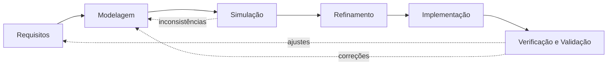

```mermaid
flowchart LR
    R[Requisitos] --> M[Modelagem]
    M --> S[Simulação]
    S --> F[Refinamento]
    F --> I[Implementação]
    I --> VV[Verificação e Validação]
    VV -. ajustes .-> R
    VV -. correções .-> M
    S -. inconsistências .-> M
```
