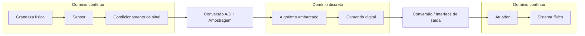

```mermaid
flowchart LR

    subgraph CONT1["Domínio contínuo"]
        P1[Grandeza física]
        S[Sensor]
        C[Condicionamento de sinal]
    end

    ADC["Conversão A/D + Amostragem"]

    subgraph DISC["Domínio discreto"]
        ALG[Algoritmo embarcado]
        CMD[Comando digital]
    end

    DAC["Conversão / Interface de saída"]

    subgraph CONT2["Domínio contínuo"]
        A[Atuador]
        P2[Sistema físico]
    end

    P1 --> S
    S --> C
    C --> ADC
    ADC --> ALG
    ALG --> CMD
    CMD --> DAC
    DAC --> A
    A --> P2
```